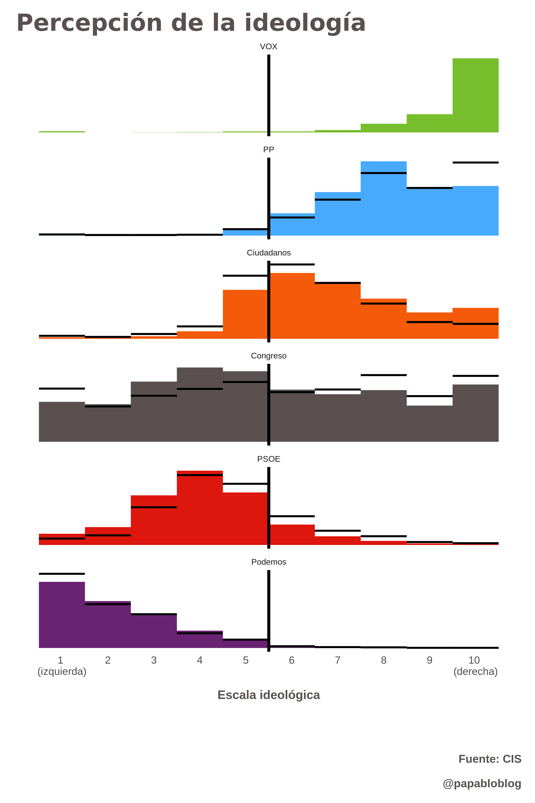

# Idea

En las **encuestas electorales realizadas por el CIS** se pregunta 

> Del 1 (izquierda) al 10 (derecha) en dónde situaría a cada uno de los partidos políticos.

La **idea** es visualizar cuál es la **distribución igeológica de cada partido político** y del congreso de los diputados (ponderando la distribución ideológica de cada partido por el porcentaje de diputados).

**Idea secundaria**: diferencia entre cómo ven todos los ciudadanos la ideología de cada partido frente a cómo la ven la de su propio partido.

# Datos

> src/data

# Gráficos

