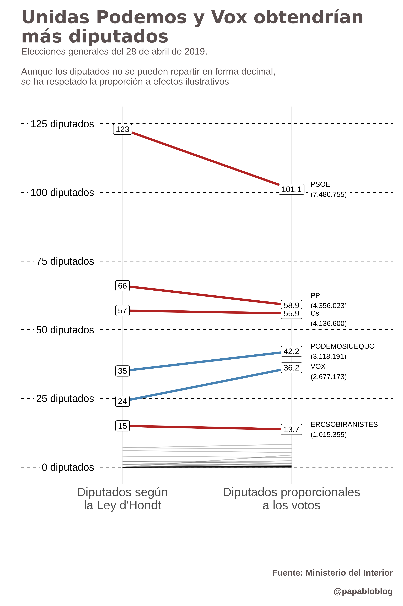
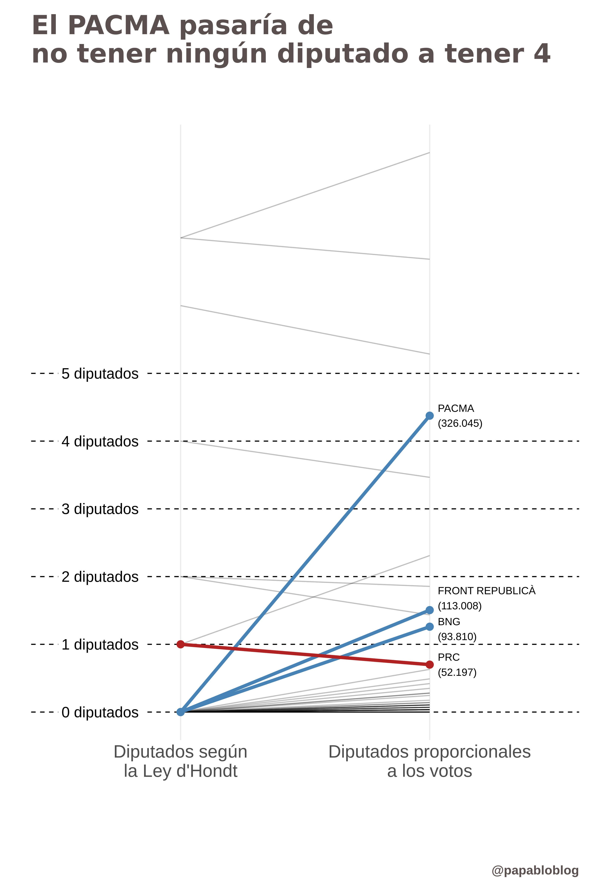
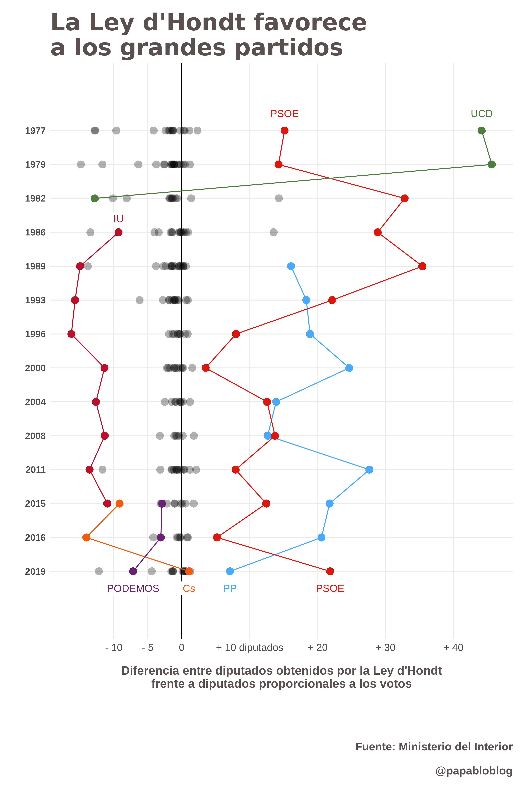

# La Ley d'Hondt

Esta carpeta contiene los códigos utilizados para los gráficos que aparecen en esta entrada de Medium en la que se compara el reparto de diputados en las elecciones generales de España del 2019 mediante la Ley d'Hondt con un sistema de reparto proporcional a los votos.

Los gráficos son 

